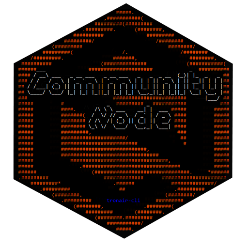
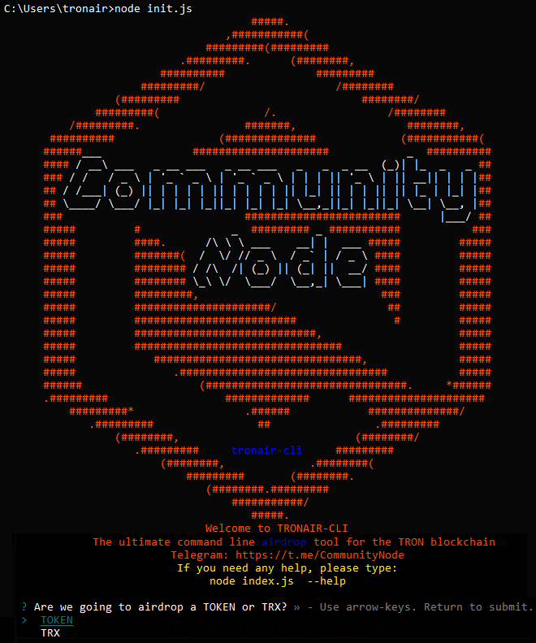

# tronair-cli  
The ultimate command-line airdrop tool for the Tron blockchain, by Community Node SR

## Installation
`mkdir test_tronair`

`cd test_tronair`

`npm init`   //accept default options..

`npm install tronair-cli`

You need to declare an _environment variable_ (at the level of OS) called **PK** containing the private key of the wallet from which you will perform the airdrop.

In the case you create a specific wallet only for airdropping porpouses, keep in mind you will need _Tron blockchain bandwidth_ or you will pay all the transactions with TRX: A single transfer is ~200 bytes, so it costs 200 Sun (0.002 TRX). Airdropping to 10k addresses would cost 20 TRX.

Create a file **index.js** in test_tronair directory with this contents:
```
var tronair = require("tronair-cli");
var m = tronair.start();
```

## Execution
**tronair-cli** can run both ways, with or without human interaction 
### - Human attended
Just run 
`node index.js`
and this will start a promt that will ask all the details about your airdrop preferences (what token are you going to airdrop, the amount, to whom are you airdropping, etc)
<p align="center">

</p>
Just follow step by step..

### - Human un-attended
If you need, let's say, to _cron schedule_ your airdrops, then you can just pass the airdrop arguments in the command line:

This is a list of the command line options:
```
-h, --help              Shows this help
-a, --amount  number    Amount to be airdropped (your wallet balance should have at least that amount) (ie: 1000322)
-i, --tokenID number    The id of the token to airdrop (ie: 1000322)
-v, --voters  string    Airdrop goes to wallets voting this SR/candidate address (ie: TDGy2M9qWBepSHDEutWWxWd1JZfmAed3BP)
-o, --holders number    Airdrop goes to wallets holding token with this id (ie: 1002000)
-e, --equal             The rewards will equally divided among all holders/voters
-p, --proportional      The rewards will be proportionally divided based on number of votes/holdings
```
+ Human un-attended examples

Example: Let's airdrop 750000 TRUC tokens to voters of CommunityNode, proportionally to their votes:

        node index.js  -i 1000322 -v TDGy2M9qWBepSHDEutWWxWd1JZfmAed3BP -a 750000 -p

Example: Let's airdrop 999999 HELP tokens to holders of TRUC, equally splitted amongst all the wallets:

        node index.js  -i 1000562 -h 1000322 -a 999999 -e

## Results
Airdropping involves lots of transactions, and sometimes things can go wrong.
In bot cases (attended or un-attended), tronair will generate json file for SUCCESS (`SUCCESS_9999_TRUC_2019_03_25at19_11_33.json`) and FAILED (`FAILED_9999_TRUC_2019_03_25at19_11_33.json`) transactions, with a descriptive name, where 9999 is the airdropped amount, along with the date and time.

//TODO: Feed tronair-cli with FAILED files. 
//TODO: Feed tronair with user CSV files

UPDATE:
04/06/2019 ADDED direct dependency on package apilister (https://www.npmjs.com/package/apilister)
{ apilister:
   { getVoters: [AsyncFunction: getVoters],
     getVotersTronairFormat: [AsyncFunction: getVotersTronairFormat],
     getHolders: [AsyncFunction: getHolders],
     getHoldersTronairFormat: [AsyncFunction: getHoldersTronairFormat] }
}

## Credits
Find us on Telegram:
https://t.me/CommunityNode
